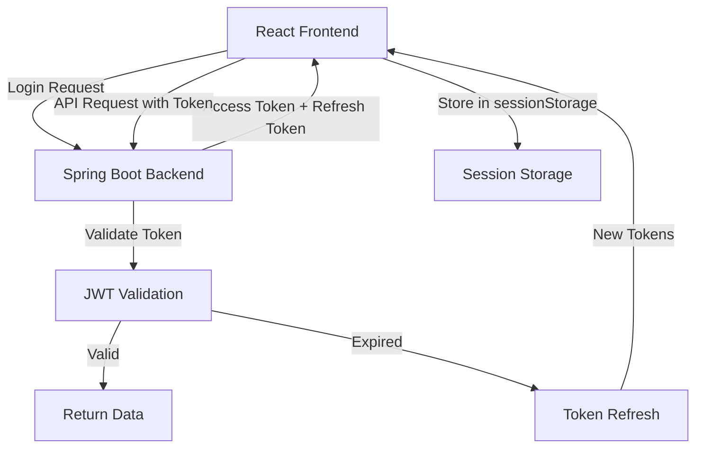
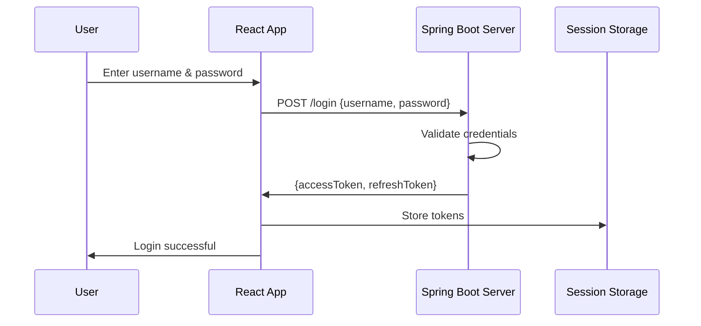
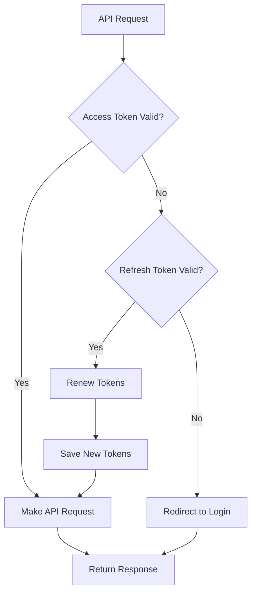
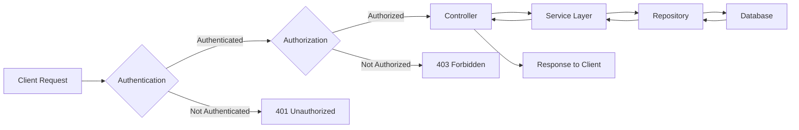
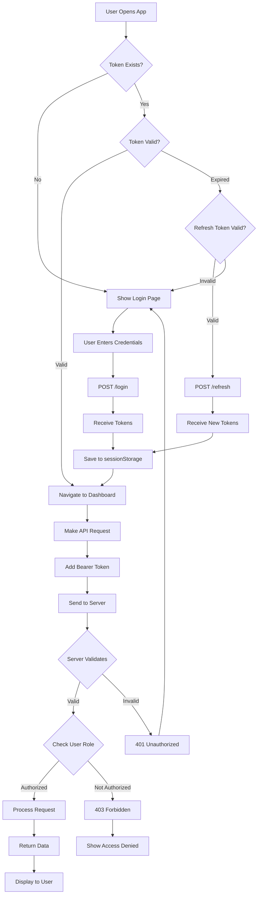

<div dir="rtl">

# מדריך מקיף לעבודה עם React, Spring Boot וטוקנים  JWT

**הנחיות לסטודנטים**

---

## תוכן עניינים

1. [מבוא](#מבוא)
2. [חלק א: התחברות וקבלת טוקנים  ב-React](#חלק-א-התחברות-וקבלת-טוקנים -ב-react)
3. [חלק ב: יצירת Wrapper לניהול טוקנים ](#חלק-ב-יצירת-wrapper-לניהול-טוקנים )
4. [חלק ג: יצירת CRUD בצד השרת](#חלק-ג-יצירת-crud-בצד-השרת)

---

## מבוא

מסמך זה מספק הנחיות מקיפות לפיתוח אפליקציה המשלבת React עם Spring Boot תוך שימוש באימות מבוסס JWT tokens. המדריך מחולק לשלושה חלקים עיקריים:

- **חלק א**: התחברות וקבלת טוקנים  - יצירת מערכת Login בסיסית
- **חלק ב**: יצירת Wrapper לניהול טוקנים  - ניהול אוטומטי של תוקף טוקנים 
- **חלק ג**: יצירת CRUD בצד השרת - הגדרת API והרשאות

### ארכיטקטורת המערכת

</div>



<div dir="rtl">

---

## חלק א: התחברות וקבלת טוקנים  ב-React

### 1. הגדרת מטרה

המטרה היא לאפשר למשתמש להתחבר לאפליקציה, לקבל את ה-JWT token וה-refresh token מהשרת ולשמור אותם ב-session storage לצורך שימוש עתידי בבקשות נוספות אל השרת.

**רכיבי המערכת:**
- אפליקציית Spring Boot (Backend)
- אפליקציית React (Frontend)
- JWT token - טוקן  גישה לזיהוי
- Refresh token - טוקן  לחידוש טוקן  הגישה
- Session storage - אחסון מקומי בדפדפן

### 2. הגדרת נקודות קצה (Endpoints)

**נקודת קצה עבור Login:**
- בשרת תוגדר נקודת קצה `login/` שאליה תישלח בקשת POST
- הבקשה תכלול פרטי התחברות (שם משתמש וסיסמה)
- נקודת הקצה תחזיר:
  - `accessToken` - לשימוש בבקשות API
  - `refreshToken` - לחידוש טוקן  הגישה

### תרשים זרימת תהליך ההתחברות

</div>



<div dir="rtl">

### 3. יצירת בקשות ל-Login

באפליקציית React נשלח את בקשת ההתחברות לשרת בעזרת Axios או Fetch API ונשמור את ה-access token וה-refresh token ב-session storage.

#### דוגמה עם Axios

</div>

```javascript
import axios from 'axios';

axios.post('/login', { username, password })
  .then(response => {
    sessionStorage.setItem("accessToken", response.data.accessToken);
    sessionStorage.setItem("refreshToken", response.data.refreshToken);
    console.log("Login successful:", response.data);
  })
  .catch(error => {
    console.error("Login failed:", error);
  });
```

<div dir="rtl">

#### דוגמה עם Fetch

</div>

```javascript
fetch('/login', {
  method: 'POST',
  headers: { 'Content-Type': 'application/json' },
  body: JSON.stringify({ username, password })
})
  .then(response => response.json())
  .then(data => {
    sessionStorage.setItem("accessToken", data.accessToken);
    sessionStorage.setItem("refreshToken", data.refreshToken);
    console.log("Login successful:", data);
  })
  .catch(error => {
    console.error("Login failed:", error);
  });
```

<div dir="rtl">

### 4. יצירת Login Component ב-React

כדי לאפשר למשתמש להתחבר, ניצור קומפוננטת Login ב-React שתשלח בקשת לוגין לשרת ותשמור את הטוקנים  ב-session storage.

#### דוגמת קומפוננטת Login מלאה

</div>

```javascript
import React, { useState } from 'react';
import axios from 'axios';

const Login = () => {
  const [username, setUsername] = useState('');
  const [password, setPassword] = useState('');
  const [error, setError] = useState(null);

  const handleLogin = async (e) => {
    e.preventDefault();
    try {
      const response = await axios.post('/login', { username, password });
      sessionStorage.setItem("accessToken", response.data.accessToken);
      sessionStorage.setItem("refreshToken", response.data.refreshToken);
      console.log("Login successful");
      // Redirect to dashboard or home page
    } catch (err) {
      setError("Login failed. Please check your credentials.");
      console.error(err);
    }
  };

  return (
    <form onSubmit={handleLogin}>
      <input
        type="text"
        placeholder="Username"
        value={username}
        onChange={(e) => setUsername(e.target.value)}
      />
      <input
        type="password"
        placeholder="Password"
        value={password}
        onChange={(e) => setPassword(e.target.value)}
      />
      <button type="submit">Login</button>
      {error && <p>{error}</p>}
    </form>
  );
};

export default Login;
```

<div dir="rtl">

### 5. סיכום חלק א

בשלב זה יצרנו:
- רכיב React שמבצע התחברות לאפליקציה
- שמירת ה-JWT token וה-refresh token ב-session storage
- טיפול בשגיאות התחברות
- בסיס לשימוש עתידי בטוקנים 

---

## חלק ב: יצירת Wrapper לניהול טוקנים 

### מטרת ה-Wrapper

ה-Wrapper יפעל סביב כל קריאה לשרת ויבדק אוטומטית את תוקף הטוקנים , כך שלא נצטרך לבדוק זאת ידנית בכל קומפוננטה.

### תרשים זרימת בדיקת טוקנים 

</div>



<div dir="rtl">

### 1. הגדרת Wrapper לכל קומפוננטה

התחל על ידי יצירת Wrapper ב-React שיפעל סביב כל קריאה לשרת. ה-Wrapper הזה יכיל לוגיקה שתופעל בכל פעם שהקומפוננטה מבצעת בקשה לשרת, כך שתמיד תיבדק תקיפות ה-access token וה-refresh token.

### 2. בדיקת תוקף ה-Access Token

- בתחילת כל בקשה לשרת, ה-Wrapper צריך לבדוק את תוקף ה-access token
- אם ה-token בתוקף, המשך בבקשה לשרת
- אחרת, עבור לבדיקה הבאה

### 3. בדיקת תוקף ה-Refresh Token

- אם ה-access token פג תוקפו, ה-Wrapper צריך לבדוק את ה-refresh token
- אם ה-refresh token בתוקף, שלח בקשה לשרת כדי לחדש את הטוקנים 
- שמור את ה-access token החדש ואת ה-refresh token החדש שוב ב-session storage
- לאחר חידוש ה-tokens, המשך עם הבקשה המקורית

### 4. ניהול מקרה שבו ה-Refresh Token פג תוקפו

- אם גם ה-refresh token פג תוקפו, יש להפנות את המשתמש אוטומטית לדף ה-login
- אפשר לבצע זאת באמצעות redirect פשוט בדפדפן לדף login

### התקנת ספריה לפענוח JWT

כדי לבצע חידוש טוקנים , נצטרך לפענח את ה-JWT ולהוציא ממנו את התאריך בו פג התוקף.

**שתי אפשרויות:**

**אפשרות 1: jwt-decode (פשוט אבל מוגבל)**
- רק מפענח את הטוקן , לא מאמת את החתימה
- מתאים לבדיקת תוקף client-side בלבד
- **אזהרה:** לא מספק אבטחה אמיתית, השרת חייב לבצע validation מלא

</div>

```bash
npm install jwt-decode
```

<div dir="rtl">

**אפשרות 2: jose (מומלץ - מודרני ומקיף)**
- מפענח ומאמת את החתימה
- תומך בכל תקני JOSE
- עדכני ונתמך באופן פעיל

</div>

```bash
npm install jose
```

<div dir="rtl">

### דוגמת קוד מלא ל-TokenWrapper עם jwt-decode

**שים לב לייבוא הנכון (גרסה 4.0.0+):**

</div>

```javascript
import React, { useEffect } from 'react';
import { useHistory } from 'react-router-dom';
import { jwtDecode } from 'jwt-decode';  // שים לב ל-named export!

const TokenWrapper = ({ children }) => {
  const history = useHistory();

  useEffect(() => {
    const checkTokens = async () => {
      // Get the tokens from session storage
      const accessToken = sessionStorage.getItem('accessToken');
      const refreshToken = sessionStorage.getItem('refreshToken');

      // Function to check if the access token is valid
      const isAccessTokenValid = (token) => {
        if (!token) return false;
        try {
          const decodedToken = jwtDecode(token);
          const expiryTime = decodedToken.exp * 1000;
          return new Date().getTime() < expiryTime;
        } catch (error) {
          return false;
        }
      };

      // If the access token is invalid or expired
      if (!isAccessTokenValid(accessToken)) {
        if (refreshToken) {
          try {
            // Send a request to the server to renew the tokens
            const response = await fetch('/refresh', {
              method: 'POST',
              headers: { 'Content-Type': 'application/json' },
              body: JSON.stringify({ refreshToken })
            });

            if (response.ok) {
              const data = await response.json();
              // Save the new tokens in session storage
              sessionStorage.setItem('accessToken', data.accessToken);
              sessionStorage.setItem('refreshToken', data.refreshToken);
            } else {
              throw new Error('Token refresh failed');
            }
          } catch (error) {
            // If token renewal fails, clear session and redirect to login
            sessionStorage.clear();
            history.push('/login');
          }
        } else {
          // If no refresh token exists, redirect to login
          sessionStorage.clear();
          history.push('/login');
        }
      }
    };

    checkTokens();
  }, [history]);

  return <>{children}</>;
};

export default TokenWrapper;
```

<div dir="rtl">

### הסבר על TokenWrapper

**1. פענוח JWT:**
- עם **jwt-decode**: `jwtDecode(token)` - רק מפענח את הטוקן , לא מאמת את החתימה
- עם **jose**: `decodeJwt(token)` - מפענח את הטוקן , ויש גם `jwtVerify()` לאימות מלא

שתי הספריות מאפשרות לפענח את ה-JWT ולהוציא מידע כמו תאריך התפוגה (expiry) של ה-access token.

**הערה חשובה:** jwt-decode רק מפענח ולא מאמת. השרת חייב תמיד לבצע validation מלא של הטוקן !

**2. בדיקת תוקף ה-access token:**
הפונקציה `isAccessTokenValid` משתמשת ב-jwt-decode כדי לפענח את ה-access token ולשלוף את תאריך התפוגה שלו. היא משווה את הזמן הנוכחי לתאריך התפוגה כדי לקבוע אם ה-token בתוקף או פג תוקפו.

**3. טיפול ב-token פג תוקף:**
אם ה-access token פג תוקפו, המערכת בודקת אם יש refresh token תקף. אם כן, תבצע בקשה לשרת לחידוש הטוקנים .

**4. כשל בחידוש הטוקנים :**
אם יש בעיה בחידוש הטוקנים  או אם גם ה-refresh token פג תוקפו, המשתמש יופנה לדף ההתחברות (login).

**5. ניהול ה-tokens ב-session storage:**
הקוד מצפה שה-token-ים (access ו-refresh) יישמרו ב-session storage. לאחר חידוש הטוקנים , יש לשמור אותם מחדש ב-session storage.

### אלטרנטיבה מודרנית: שימוש ב-jose

אם תרצו לעבוד עם ספרייה מודרנית יותר שגם יודעת לאמת טוקנים , הנה דוגמה עם jose:

</div>

```javascript
import React, { useEffect } from 'react';
import { useHistory } from 'react-router-dom';
import { decodeJwt } from 'jose';

const TokenWrapper = ({ children }) => {
  const history = useHistory();

  useEffect(() => {
    const checkTokens = async () => {
      const accessToken = sessionStorage.getItem('accessToken');
      const refreshToken = sessionStorage.getItem('refreshToken');

      const isAccessTokenValid = (token) => {
        if (!token) return false;
        try {
          const decodedToken = decodeJwt(token);
          const expiryTime = decodedToken.exp * 1000;
          return new Date().getTime() < expiryTime;
        } catch (error) {
          return false;
        }
      };

      if (!isAccessTokenValid(accessToken)) {
        if (refreshToken) {
          try {
            const response = await fetch('/refresh', {
              method: 'POST',
              headers: { 'Content-Type': 'application/json' },
              body: JSON.stringify({ refreshToken })
            });

            if (response.ok) {
              const data = await response.json();
              sessionStorage.setItem('accessToken', data.accessToken);
              sessionStorage.setItem('refreshToken', data.refreshToken);
            } else {
              throw new Error('Token refresh failed');
            }
          } catch (error) {
            sessionStorage.clear();
            history.push('/login');
          }
        } else {
          sessionStorage.clear();
          history.push('/login');
        }
      }
    };

    checkTokens();
  }, [history]);

  return <>{children}</>;
};

export default TokenWrapper;
```

<div dir="rtl">

**יתרונות jose על פני jwt-decode:**
- ספרייה פעילה ומתעדכנת (עדכון אחרון לפני חודש)
- תמיכה מלאה ב-JWT, JWS, JWE, JWK
- יכולת גם לאמת (verify) ולא רק לפענח (decode)
- תמיכה ב-async/await
- עובד על פלטפורמות שונות (דפדפן, Node.js, Deno, Bun)

### קומפוננטת DataFetcher המשתמשת ב-TokenWrapper

להלן דוגמה לשימוש ב-Wrapper בקומפוננטה שמבצעת קריאה לשרת לאחר בדיקת תוקף הטוקנים  באמצעות ה-TokenWrapper.

</div>

```javascript
import React, { useState, useEffect } from 'react';
import TokenWrapper from './TokenWrapper';

const DataFetcher = () => {
  const [data, setData] = useState(null);
  const [loading, setLoading] = useState(true);
  const [error, setError] = useState(null);

  useEffect(() => {
    const fetchData = async () => {
      try {
        const accessToken = sessionStorage.getItem('accessToken');
        const response = await fetch('https://your-server-api.com/protected-data', {
          method: 'GET',
          headers: {
            Authorization: `Bearer ${accessToken}`,
          },
        });

        if (!response.ok) {
          throw new Error('Failed to fetch data');
        }

        const result = await response.json();
        setData(result);
      } catch (err) {
        setError('Failed to fetch data');
        console.error(err);
      } finally {
        setLoading(false);
      }
    };

    fetchData();
  }, []);

  if (loading) return <p>Loading...</p>;
  if (error) return <p>{error}</p>;

  return (
    <div>
      <h1>Fetched Data:</h1>
      <pre>{JSON.stringify(data, null, 2)}</pre>
    </div>
  );
};

const WrappedComponent = () => {
  return (
    <TokenWrapper>
      <DataFetcher />
    </TokenWrapper>
  );
};

export default WrappedComponent;
```

<div dir="rtl">

### הסבר על השימוש ב-Wrapper

**1. קומפוננטת DataFetcher:**
- ה-access token נלקח מ-sessionStorage והוא נשלח בכותרת הבקשה (Authorization header)
- הבקשה נעשית לשרת המאובטח, ואם הכל תקין, התגובה מומרת ל-JSON ומוצגת למשתמש
- אם הבקשה נכשלת (למשל, אם הטוקן  אינו תקף או שיש בעיה בשרת), מתקבלת הודעת שגיאה

**2. שימוש ב-TokenWrapper:**
- ה-TokenWrapper עוטף את ה-DataFetcher, מוודא שה-access token בתוקף לפני ביצוע הקריאה לשרת
- אם ה-token אינו בתוקף, הקומפוננטה תטפל בחידוש הטוקן  או תפנה את המשתמש לדף ה-login

**התנהגות:**
כשמופעלת הקומפוננטה WrappedComponent, ה-TokenWrapper בודק את תוקף הטוקן . אם הוא בתוקף, ה-DataFetcher תוכל לבצע קריאת API ולהציג את המידע.

---

## חלק ג: יצירת CRUD בצד השרת

לחלק השני של המשימה, עליכם לבנות מיפוי לפעולות CRUD בצד השרת ויש להוסיף הרשאות בקובץ ה-SecurityConfig בהתאם ל-roles של המשתמשים.

### תרשים ארכיטקטורת ה-CRUD

</div>



<div dir="rtl">

### 1. יצירת מיפוי לפעולות CRUD ב-Controller

תצטרכו להגדיר פעולות CRUD (יצירה, קריאה, עדכון ומחיקה) בצד השרת. לדוגמה, כשמדובר בניהול משתמשים, המיפוי ייראה כך:

</div>

```java
@RestController
@RequestMapping("/users")
public class UserController {

    @GetMapping
    public List<UserDto> getAllUsers() {
        // החזרת רשימת כל המשתמשים
    }

    @GetMapping("/{id}")
    public UserDto getUserById(@PathVariable Long id) {
        // החזרת משתמש לפי ID
    }

    @PostMapping
    public UserDto createUser(@RequestBody UserDto userDto) {
        // יצירת משתמש חדש
    }

    @PutMapping("/{id}")
    public UserDto updateUser(@PathVariable Long id, @RequestBody UserDto userDto) {
        // עדכון פרטי משתמש קיים
    }

    @DeleteMapping("/{id}")
    public void deleteUser(@PathVariable Long id) {
        // מחיקת משתמש לפי ID
    }
}
```

<div dir="rtl">

### 2. הוספת הרשאות בקובץ ה-SecurityConfig בהתאם ל-roles

יש להוסיף את ההרשאות הרלוונטיות בקובץ ה-SecurityConfig לפי סוג המשתמש וה-roles שיש לו. לדוגמה, משתמש עם תפקיד ADMIN יוכל לבצע את כל הפעולות, בעוד שמשתמש עם תפקיד USER יוכל לצפות בנתונים אך לא לעדכן או למחוק.

#### דוגמת SecurityConfig

</div>

```java
@Configuration
@EnableWebSecurity
public class SecurityConfig extends WebSecurityConfigurerAdapter {

    @Override
    protected void configure(HttpSecurity http) throws Exception {
        http
            .csrf().disable()
            .authorizeRequests()
                // Public endpoints
                .antMatchers("/login", "/register").permitAll()
                
                // User endpoints - accessible by authenticated users
                .antMatchers(HttpMethod.GET, "/users/**").hasAnyRole("USER", "ADMIN")
                
                // Admin-only endpoints
                .antMatchers(HttpMethod.POST, "/users/**").hasRole("ADMIN")
                .antMatchers(HttpMethod.PUT, "/users/**").hasRole("ADMIN")
                .antMatchers(HttpMethod.DELETE, "/users/**").hasRole("ADMIN")
                
                // All other requests must be authenticated
                .anyRequest().authenticated()
            .and()
            .sessionManagement()
                .sessionCreationPolicy(SessionCreationPolicy.STATELESS)
            .and()
            .addFilterBefore(jwtAuthenticationFilter(), UsernamePasswordAuthenticationFilter.class);
    }

    @Bean
    public JwtAuthenticationFilter jwtAuthenticationFilter() {
        return new JwtAuthenticationFilter();
    }
}
```

<div dir="rtl">

### הסבר על הגדרות האבטחה

**1. CRUD ב-Controller:**
- ב-Controller יש להגדיר את כל פעולות ה-CRUD: יצירה, קריאה, עדכון, מחיקה
- יש להשתמש ב-DTOs לניהול נתונים

**2. הגדרת הרשאות בקובץ ה-SecurityConfig:**
- **ניהול גישה לפי סוגי בקשות HTTP:** בקשות GET יוכלו להתבצע על ידי כל משתמש עם roles מתאימים (USER או ADMIN)
- **יצירה, עדכון ומחיקה:** מוגבלים רק ל-ADMIN
- **נקודות קצה ציבוריות:** /login ו-/register פתוחים לכולם

### מיפוי הרשאות לפי תפקידים

| פעולה | Method | Endpoint    | USER | ADMIN |
|-------|--------|-------------|------|-------|
| צפייה ברשימת משתמשים | GET | users/      | כן | כן |
| צפייה במשתמש ספציפי | GET | users/{id}/ | כן | כן |
| יצירת משתמש | POST | users/      | לא | כן |
| עדכון משתמש | PUT | users/{id}/ | לא | כן |
| מחיקת משתמש | DELETE | users/{id}/ | לא | כן |

### שלבים להשלמה

**1. כתיבת המיפוי ל-CRUD ב-Controller:**
- הגדר את כל נקודות הקצה הנדרשות
- השתמש ב-DTOs לניהול נתונים
- הוסף טיפול בשגיאות

**2. הוספת ההרשאות הרלוונטיות בקובץ ה-SecurityConfig:**
- הגדר הרשאות לפי roles של המשתמשים
- וודא שנקודות קצה ציבוריות מוגדרות כראוי
- הוסף JWT filter לאימות

**3. בדיקה שהגישה לנתונים תואמת ל-roles השונים:**
- בדוק שמשתמש עם role USER יכול לצפות אך לא לערוך
- בדוק שמשתמש עם role ADMIN יכול לבצע את כל הפעולות
- בדוק שמשתמש לא מחובר לא יכול לגשת לנתונים מוגנים

---

## סיכום כללי

במדריך זה למדנו:

**חלק א - התחברות וקבלת טוקנים :**
- יצירת קומפוננטת Login ב-React
- שליחת בקשות לשרת והטיפול בתשובות
- שמירת טוקנים  ב-session storage

**חלק ב - ניהול טוקנים  עם Wrapper:**
- יצירת TokenWrapper לבדיקת תוקף טוקנים 
- חידוש אוטומטי של טוקנים 
- טיפול בפג תוקף והפניה ל-login
- שימוש ב-jwt-decode לפענוח טוקנים 

**חלק ג - CRUD בצד השרת:**
- הגדרת Controller עם פעולות CRUD מלאות
- הגדרת SecurityConfig עם הרשאות לפי roles
- הפרדה בין משתמשים רגילים למנהלים

### תרשים זרימה מלא של המערכת

</div>



<div dir="rtl">

### עצות חשובות

**אבטחה:**
- אל תשמור טוקנים  ב-localStorage אם יש דרישות אבטחה גבוהות
- הגדר זמני תפוגה סבירים לטוקנים 
- בצע validation מלא בצד השרת

**ביצועים:**
- שמור טוקנים  ב-sessionStorage לצורך מהירות
- השתמש ב-interceptors של Axios לטיפול אוטומטי בטוקנים 
- בצע caching של נתונים שאינם משתנים

**ארכיטקטורה:**
- הפרד בין לוגיקה עסקית לבין ניהול טוקנים 
- צור services ייעודיים לניהול אימות

**בדיקות:**
- בדוק תרחישי edge cases (פג תוקף, חיבור איטי, שגיאות שרת)

---

## משאבים נוספים

**תיעוד רשמי:**
- [React Documentation](https://react.dev)
- [Spring Boot Documentation](https://spring.io/projects/spring-boot)
- [JWT.io](https://jwt.io)

**ספריות מומלצות:**
- `jose` - **מומלץ!** ספרייה מודרנית לעבודה עם JWT, תומכת בפענוח, אימות, הצפנה ותקני JOSE (גרסה 6.x, עדכון אחרון לפני חודש)
- `jwt-decode` - פענוח JWT בלבד ללא validation (גרסה 4.x, עדכון לפני שנתיים)
  - **שים לב:** החל מגרסה 4.0.0 הייבוא הוא `import { jwtDecode } from 'jwt-decode'`
- `axios` - HTTP client עם interceptors
- `react-router-dom` - ניהול ניווט
- `spring-security` - אבטחה ב-Spring Boot
---

**בהצלחה !**

*מסמך זה הוכן למטרות לימודיות ומכיל את כל המידע הנדרש ליצירת מערכת אימות מלאה עם React ו-Spring Boot.*

</div>
